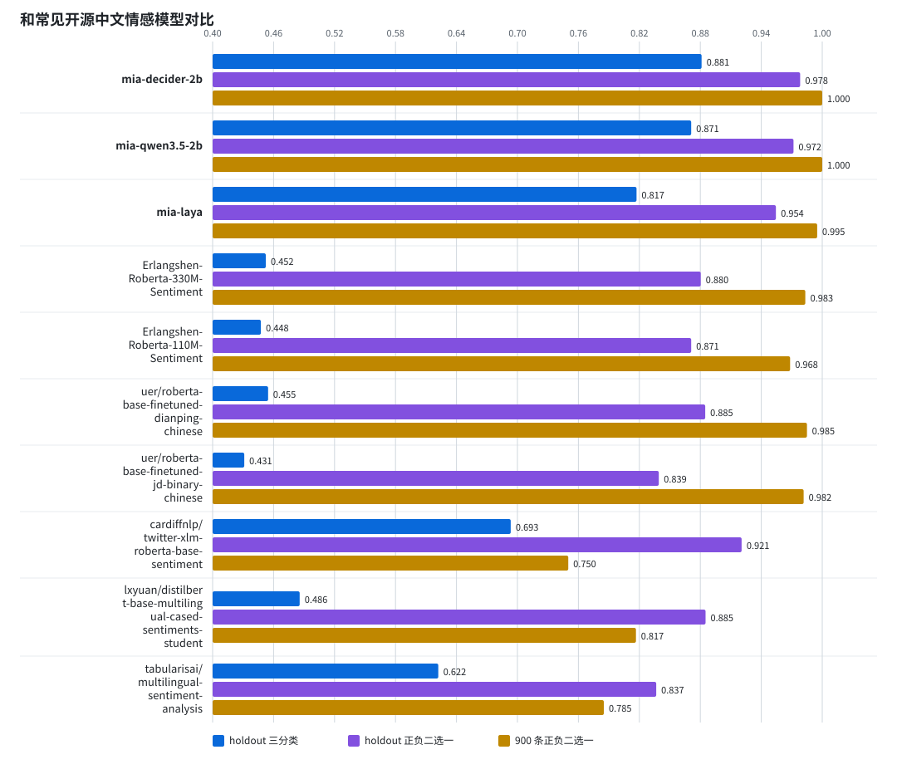
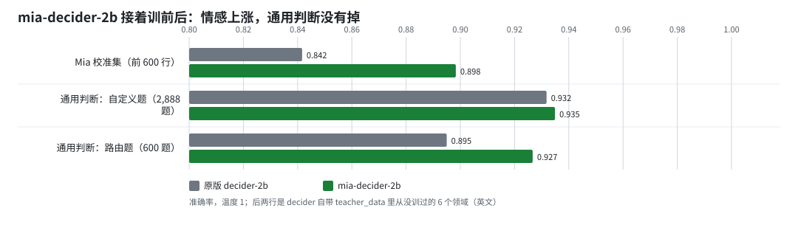
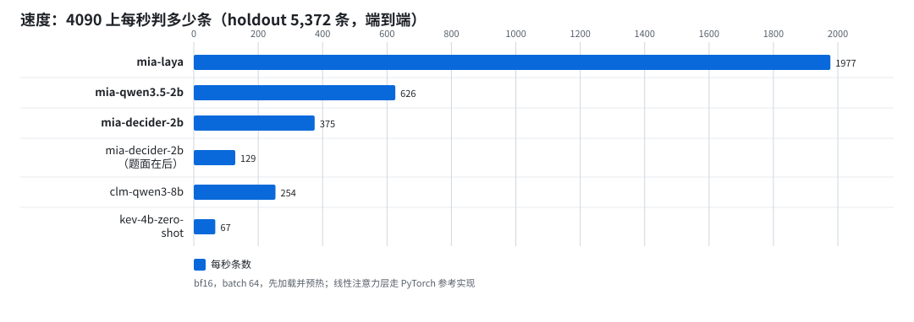
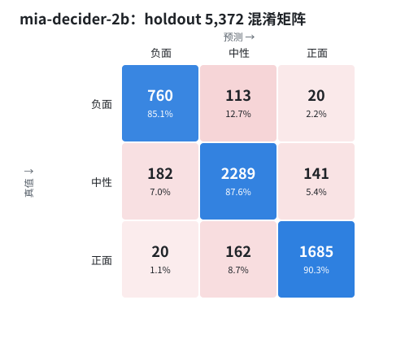

# Mia · 中文短文本情感三分类

Mia 是一组给中文短文本判「负面 / 中性 / 正面」的小模型。这个仓库公开三个发布版本的权重、全部评测数据、每一次实验的报告和脚本，以及我们在标签、底座、口径上踩过的坑。

图表和完整表格见 [docs/index.html](docs/index.html)，下面是浓缩版。

## 三个版本

| 版本 | 底座 | 参数量 | holdout 5,372 Acc / Macro-F1 | 中文 900 条 Acc / Macro-F1 | 权重 | 加载方式 | 什么时候选它 |
| --- | --- | ---: | --- | --- | ---: | --- | --- |
| `mia-decider-2b` | [Mapika/decider-2b](https://huggingface.co/Mapika/decider-2b) v11（在 Qwen3.5-2B-Base 上训练的 Jev 式决策模型）全量微调 | 1,882M | 0.8812 / 0.8705 | 0.9400 / 0.9397 | bf16 约 3.8G，HF / ModelScope 下载 | [decider](https://github.com/Mapika/decider) 的 `Decider`，`schema(...).batch` | 默认推荐。开发集、holdout 和校准误差都是三个里最好的，负面召回 0.851 最高；公开评论集上的正负判断与 `mia-qwen3.5-2b` 持平，微博高 3.3 个百分点。它仍是一个决策模型，同一份权重还能回答你自己写的选择题、是非题和打分题（中文的这部分没有评测，见「局限」）。4090 上每秒约 375 条。 |
| `mia-qwen3.5-2b` | [Qwen/Qwen3.5-2B](https://huggingface.co/Qwen/Qwen3.5-2B) 文本主干 + 线性分类头 | 1,882M | 0.8710 / 0.8564 | 0.9411 / 0.9411 | bf16 约 3.6G，HF / ModelScope 下载 | `transformers` 的 `Qwen3_5TextForSequenceClassification` | 只要情感三分类、想要更快。中文 900 条最高（比 decider 版多对 1 条），中性召回 0.903 最高；与 Laya 版的差距几乎全在中性文本：客观陈述、转述、褒贬并存的文本它能认出来，负面 / 正面的精确率因此高 8 到 14 个百分点。4090 上每秒约 626 条。 |
| `mia-laya` | [convaiinnovations/laya-multilingual](https://huggingface.co/convaiinnovations/laya-multilingual)（mmBERT-base）判别头微调 | 322M | 0.8172 / 0.8028 | 0.9367 / 0.9362 | fp32 约 1.3G，HF / ModelScope 下载 | `laya` SDK 0.3.20 的 `laya.load` | 吞吐优先。4090 上每秒约 1,977 条，一张 8G 卡就能跑。 |

三个版本都在同一套评测集上评，标签口径相同；数字都是校准温度之后的。速度是在同一张 RTX 4090 上用同一种方法测的（bf16，batch 64，holdout 5,372 条端到端，`reports/*/throughput.json`），此前写的 340 / 1,600 条是较早、口径不统一的估计。

几个对照：起点模型（早期标签 + Laya）在同一 holdout 上是 0.6960 / 0.6882，中文 900 条 0.8644 / 0.8564；未微调的原版 Qwen3.5-2B 用同一套三分类口径零样本作答，holdout 0.6372 / 0.6283，中文 900 条 0.7944 / 0.7738；未微调的 decider-2b 用同一套定义作题面零样本作答，holdout 已经有 0.8438 / 0.8320，中文 900 条 0.9078 / 0.9060。在它上面接着训一轮，holdout 再涨 3.7 个百分点。


## 和常见开源中文情感模型对比

| 模型 | 类别 | holdout 5,372 三分类 | 中文 900 条三分类 | holdout 正负二选一 | 900 条正负二选一 | ChnSentiCorp | 网购评论 | eprstmt | 微博 | DMSC Macro-F1 | 4090 每秒条数 |
| --- | --- | ---: | ---: | ---: | ---: | ---: | ---: | ---: | ---: | ---: | ---: |
| [**mia-decider-2b**](https://huggingface.co/leafiy/mia-decider-2b) | 负 / 中 / 正 | **0.881** | 0.940 | **0.978** | **1.000** | 0.880 | 0.921 | 0.893 | **0.830** | **0.519** | 375 |
| [**mia-qwen3.5-2b**](https://huggingface.co/leafiy/mia-qwen3.5-2b) | 负 / 中 / 正 | 0.871 | **0.941** | 0.972 | **1.000** | 0.882 | 0.922 | 0.897 | 0.798 | 0.499 | 626 |
| [**mia-laya**](https://huggingface.co/leafiy/mia-laya) | 负 / 中 / 正 | 0.817 | 0.938 | 0.954 | 0.995 | 0.883 | 0.919 | 0.882 | 0.803 | 0.467 | 1,977 |
| [Erlangshen-Roberta-330M-Sentiment](https://huggingface.co/IDEA-CCNL/Erlangshen-Roberta-330M-Sentiment) | 负 / 正 | 0.452 | 0.656 | 0.880 | 0.983 | **0.968** | **0.989** | **0.997** | 0.729 | 0.415 | 1,378 |
| [Erlangshen-Roberta-110M-Sentiment](https://huggingface.co/IDEA-CCNL/Erlangshen-Roberta-110M-Sentiment) | 负 / 正 | 0.448 | 0.646 | 0.871 | 0.968 | 0.962 | 0.979 | 0.982 | 0.721 | 0.409 | 3,809 |
| [uer/roberta-base-finetuned-dianping-chinese](https://huggingface.co/uer/roberta-base-finetuned-dianping-chinese) | 负 / 正 | 0.455 | 0.657 | 0.885 | 0.985 | 0.877 | 0.894 | 0.795 | 0.726 | 0.414 | 3,812 |
| [uer/roberta-base-finetuned-jd-binary-chinese](https://huggingface.co/uer/roberta-base-finetuned-jd-binary-chinese) | 负 / 正 | 0.431 | 0.654 | 0.839 | 0.982 | 0.834 | 0.928 | 0.902 | 0.704 | 0.455 | 3,795 |
| [cardiffnlp/twitter-xlm-roberta-base-sentiment](https://huggingface.co/cardiffnlp/twitter-xlm-roberta-base-sentiment) | 负 / 中 / 正 | 0.693 | 0.664 | 0.921 | 0.750 | 0.809 | 0.894 | 0.848 | 0.813 | 0.397 | 3,650 |
| [lxyuan/distilbert-base-multilingual-cased-sentiments-student](https://huggingface.co/lxyuan/distilbert-base-multilingual-cased-sentiments-student) | 负 / 中 / 正 | 0.486 | 0.560 | 0.885 | 0.817 | 0.852 | 0.903 | 0.864 | 0.797 | 0.447 | 6,699 |
| [tabularisai/multilingual-sentiment-analysis](https://huggingface.co/tabularisai/multilingual-sentiment-analysis) | 五档合为三类 | 0.622 | 0.777 | 0.837 | 0.785 | 0.822 | 0.868 | 0.841 | 0.668 | 0.374 | 6,556 |

同一套评测、同一台 RTX 4090（batch 64），脚本 `scripts/evaluate-public-benchmarks.py`（开源模型用 `--model-type hf`）与 `scripts/benchmark-throughput.py`，逐模型报告在 `reports/open-models/`。



## 成绩总览

十二次训练和四个未训练的基线全部用同一脚本在三套评测集上重评，每格是 准确率 / Macro-F1 / 中性召回。评测集的定义在「数据」一节。

| 模型 | 底座 | 参数量 | 训练标签 | 类别权重 | epochs | 开发集 4,920 | holdout 5,372 | 中文 CSV 900 |
| --- | --- | ---: | --- | --- | ---: | --- | --- | --- |
| `qwen3.5-2b-zero-shot` | Qwen3.5-2B 原版，未微调，零样本受限选择 | 约 2B | 无（零样本，同一三分类口径的提示词） | — | — | 0.6433 / 0.6361 / 0.362 | 0.6372 / 0.6283 / 0.351 | 0.7944 / 0.7738 / 0.390 |
| `decider-2b-zero-shot` | decider-2b v11 原版，零样本 | 1.9B | 无（零样本，同一三分类定义作题面） | — | — | 0.8461 / 0.8337 / 0.834 | 0.8438 / 0.8320 / 0.822 | 0.9078 / 0.9060 / 0.730 |
| `kev-4b-zero-shot` | Kev-4B（Qwen3.5-4B-Base + LoRA + 指针头），零样本 | 4.2B | 无（零样本，同一三分类定义作题面） | — | — | 0.8419 / 0.8251 / 0.854 | 0.8429 / 0.8297 / 0.843 | 0.8667 / 0.8609 / 0.600 |
| `clm-v0.1-8b-zero-shot` | Qwen3-8B + CLM-v0.1-8B 参考头，零样本 | 8B + 18.9M | 无（零样本，数据集自带的短题面） | — | — | 0.3437 / 0.1705 / 0.000 | 0.3475 / 0.1719 / 0.000 | 0.3333 / 0.1667 / 0.000 |
| `laya-oldlabels` | Laya multilingual (mmBERT-base) | 322M | 早期机器标签 | none | 3 | 0.6941 / 0.6888 / 0.488 | 0.6960 / 0.6882 / 0.484 | 0.8644 / 0.8564 / 0.630 |
| `laya-oldlabels-neutral-reviewed` | Laya multilingual (mmBERT-base) | 322M | 早期机器标签 + 两轮 AI 复核中性 | none | 3 | 0.6785 / 0.6725 / 0.424 | 0.6811 / 0.6739 / 0.421 | 0.8056 / 0.7807 / 0.433 |
| `laya-oldlabels-cw-none` | Laya multilingual (mmBERT-base) | 322M | 早期机器标签 | none | 3 | 0.6915 / 0.6862 / 0.483 | 0.6940 / 0.6863 / 0.480 | 0.8622 / 0.8540 / 0.627 |
| `laya-oldlabels-cw-sqrt` | Laya multilingual (mmBERT-base) | 322M | 早期机器标签 | sqrt | 3 | 0.6992 / 0.6931 / 0.508 | 0.7022 / 0.6935 / 0.500 | 0.8700 / 0.8642 / 0.667 |
| `laya-oldlabels-cw-balanced` | Laya multilingual (mmBERT-base) | 322M | 早期机器标签 | balanced | 3 | 0.7089 / 0.7031 / 0.532 | 0.7103 / 0.7014 / 0.523 | 0.8800 / 0.8754 / 0.693 |
| `laya-relabeled-cw-none` | Laya multilingual (mmBERT-base) | 322M | 大模型重标（褒贬混合剔除） | none | 3 | 0.8108 / 0.7951 / 0.795 | 0.8178 / 0.8015 / 0.788 | 0.9344 / 0.9339 / 0.823 |
| **`mia-laya`** | Laya multilingual (mmBERT-base) | 322M | 大模型重标（褒贬混合剔除） | balanced | 3 | 0.8108 / 0.7974 / 0.778 | 0.8172 / 0.8028 / 0.770 | 0.9367 / 0.9362 / 0.833 |
| `qwen0.8b-relabeled` | Qwen3.5-0.8B 文本主干 | 752M | 大模型重标（褒贬混合剔除） | none | 3 | 0.8366 / 0.8233 / 0.826 | 0.8358 / 0.8236 / 0.816 | 0.8644 / 0.8607 / 0.640 |
| `qwen2b-relabeled` | Qwen3.5-2B 文本主干 | 1,882M | 大模型重标（褒贬混合剔除） | none | 3 | 0.8423 / 0.8300 / 0.831 | 0.8448 / 0.8311 / 0.829 | 0.9178 / 0.9166 / 0.760 |
| **`mia-qwen3.5-2b`** | Qwen3.5-2B 文本主干 | 1,882M | 大模型重标（褒贬混合并入中性） | none | 2 | 0.8689 / 0.8543 / 0.896 | 0.8710 / 0.8564 / 0.892 | 0.9411 / 0.9411 / 0.903 |
| `clm-qwen3-8b` | Qwen3-8B 冻结 + CLM 投影头（不热启动） | 7,587M | 大模型重标（褒贬混合并入中性） | none | 40（取第 33 轮） | 0.8720 / 0.8623 / 0.878 | 0.8669 / 0.8558 / 0.873 | 0.8378 / 0.8362 / 0.697 |
| **`mia-decider-2b`** | decider-2b v11（Qwen3.5-2B-Base + 决策训练） | 1,882M | 大模型重标（褒贬混合并入中性）+ 15% 通用决策回放 | none | 1 | 0.8866 / 0.8763 / 0.888 | 0.8812 / 0.8705 / 0.876 | 0.9400 / 0.9397 / 0.840 |

前四行是没有在 Mia 数据上训练过的基线：

- 原版 Qwen3.5-2B 拿到与 Mia 训练口径相同的三类定义（褒贬并存算中性），关闭思考模式，只比较下一个 token 在「负面 / 中性 / 正面」三个词上的 logits，没有微调也没有校准。它在 holdout 上把 2,612 条中性里的 1,268 条判成负面，负面召回 0.985、中性召回 0.351；微调后的 `mia-qwen3.5-2b` 用同一个底座把 holdout 从 0.6372 抬到 0.8710。批量左填充与逐条不填充的结果在 48 条自检上有 1 条 argmax 不同，概率最大差 0.06。
- decider-2b 和 Kev-4B 是两个开源的 Jev 式（System One）决策模型：输入一段文本和若干带定义的题目，一次前向给出每题的概率分布。两者的训练数据都只有英文，题面用的是同一套三类定义（`scripts/evaluate-systemone-sentiment.py` 里的 `QUESTIONS`），概率用各自权重自带的温度。它们比原版 Qwen3.5-2B 零样本高 20 个点，短板是中性：中文 900 条里 300 条中性，decider 判错 81 条，Kev 判错 120 条。
- CLM 的参考头（[Contrastive-LM/CLM-v0.1-8B](https://huggingface.co/Contrastive-LM/CLM-v0.1-8B)）不训练直接用，把每条都判成同一类：中文题面全判正面，换成英文题面（只在开发集上试过）又几乎全判负面（0.3059）。图表里不画它。


每个模型的完整报告（开发集 / holdout / 中文 CSV 的评估，训练模型另有 `metrics.json`、`history.json`、`training-config.json`、`throughput.json`）在 `reports/<模型名>/`，汇总在 `reports/summary.json`。

## 公开数据集上的成绩

三个发布版和其余对照模型都没有在下面任何一个数据集上训练过，全部是直接拿来测。这些集子大多只有正负两类，而 Mia 有三类，所以每个二分类集给四个数：**二选一准确率**只比较正、负两类的概率，是和二分类模型对齐的口径；**三选一严格准确率**把判成中性的行都算错；**判为中性的比例**说明模型有多少行没有给出极性；**只看给出极性的行的准确率**说明它一旦表态有多准。豆瓣影评用星级凑出三类，3 星当中性只是近似。文本先做与训练相同的归一化并截到 512 字。

| 公开数据集 | 行数 | 指标 | `mia-decider-2b` | `mia-qwen3.5-2b` | `mia-laya` | `laya-oldlabels` | `qwen3.5-2b-zero-shot` | `decider-2b-zero-shot` | `kev-4b-zero-shot` | `clm-qwen3-8b` |
| --- | ---: | --- | ---: | ---: | ---: | ---: | ---: | ---: | ---: | ---: |
| [ChnSentiCorp](https://huggingface.co/datasets/lansinuote/ChnSentiCorp) test，酒店 / 书籍 / 电脑评论 | 1,200 | 二选一准确率 | 0.8800 | 0.8817 | 0.8833 | 0.8783 | 0.8583 | 0.8850 | 0.8908 | 0.8642 |
| | | 三选一严格准确率 | 0.6883 | 0.6508 | 0.8225 | 0.8275 | 0.8067 | 0.7558 | 0.7750 | 0.6475 |
| | | 判为中性的比例 | 0.272 | 0.312 | 0.087 | 0.083 | 0.082 | 0.182 | 0.172 | 0.314 |
| | | 只看给出极性的行的准确率 | 0.9451 | 0.9455 | 0.9005 | 0.9027 | 0.8784 | 0.9236 | 0.9366 | 0.9441 |
| [online_shopping_10_cats](https://huggingface.co/datasets/dirtycomputer/online_shopping_10_cats)，十类商品评论，抽样 | 5,000 | 二选一准确率 | 0.9208 | 0.9224 | 0.9186 | 0.9192 | 0.8964 | 0.9274 | 0.9302 | 0.9182 |
| | | 三选一严格准确率 | 0.7968 | 0.7754 | 0.8786 | 0.8754 | 0.8562 | 0.8390 | 0.8344 | 0.7768 |
| | | 判为中性的比例 | 0.176 | 0.199 | 0.058 | 0.066 | 0.062 | 0.122 | 0.133 | 0.196 |
| | | 只看给出极性的行的准确率 | 0.9672 | 0.9676 | 0.9325 | 0.9377 | 0.9130 | 0.9560 | 0.9628 | 0.9659 |
| [eprstmt](https://huggingface.co/datasets/suolyer/eprstmt)（FewCLUE）test，电商评论 | 610 | 二选一准确率 | 0.8934 | 0.8967 | 0.8820 | 0.8803 | 0.8426 | 0.9049 | 0.8951 | 0.8885 |
| | | 三选一严格准确率 | 0.6738 | 0.6721 | 0.8180 | 0.8033 | 0.7918 | 0.7525 | 0.7410 | 0.6852 |
| | | 判为中性的比例 | 0.298 | 0.298 | 0.087 | 0.120 | 0.092 | 0.197 | 0.223 | 0.285 |
| | | 只看给出极性的行的准确率 | 0.9603 | 0.9579 | 0.8959 | 0.9125 | 0.8718 | 0.9367 | 0.9536 | 0.9587 |
| [weibo_senti_100k](https://huggingface.co/datasets/dirtycomputer/weibo_senti_100k)，微博，表情符号推出的标签，抽样 | 5,000 | 二选一准确率 | 0.8302 | 0.7976 | 0.8030 | 0.8278 | 0.8046 | 0.8192 | 0.8206 | 0.8342 |
| | | 三选一严格准确率 | 0.6570 | 0.6162 | 0.6650 | 0.7680 | 0.7810 | 0.6430 | 0.5896 | 0.6568 |
| | | 判为中性的比例 | 0.240 | 0.271 | 0.192 | 0.086 | 0.034 | 0.251 | 0.319 | 0.250 |
| | | 只看给出极性的行的准确率 | 0.8645 | 0.8455 | 0.8228 | 0.8399 | 0.8085 | 0.8587 | 0.8658 | 0.8755 |
| [DMSC](https://huggingface.co/datasets/BerlinWang/DMSC) 豆瓣影评，1-2 星负 / 3 星中 / 4-5 星正，抽样 | 5,000 | 三分类准确率 | 0.5352 | 0.5120 | 0.5422 | 0.5728 | 0.5048 | 0.5532 | 0.5982 | 0.5220 |
| | | 三分类 Macro-F1 | 0.5190 | 0.4992 | 0.4666 | 0.4890 | 0.4214 | 0.5150 | 0.5605 | 0.5108 |
| | | 中性（3 星）召回 | 0.492 | 0.508 | 0.216 | 0.235 | 0.111 | 0.389 | 0.473 | 0.522 |


怎么读：

- 商品和酒店评论上，三个 Mia 版本的二选一准确率都在 0.88 到 0.92，`mia-decider-2b` 和 `mia-qwen3.5-2b` 一旦表态准确率 0.945 到 0.968。在这些数据集自己的训练集上微调过的模型通常能报到 0.95 上下，跨领域直接测差 3 到 7 个百分点，主要差在长评论：ChnSentiCorp 平均 100 多字、常常一段夸一段骂，而训练文本不超过 100 字。
- `mia-decider-2b` 和 `mia-qwen3.5-2b` 把两成到三成的评论判成中性，严格准确率因此低。这不是它们读不懂，是它们按训练口径把褒贬并存和纯陈述当成了中性，而这些数据集没有中性这个选项。要用它们做二分类，请比较正负两类概率，不要看 argmax。
- 两个决策模型零样本在三个评论集上的二选一准确率在 0.885 到 0.930，和微调版本不相上下，多数还更高。在这些集子上，正负判断主要来自底座和决策训练；Mia 的数据带来的主要是中性口径。`mia-decider-2b` 接着训之后这三个集子降了 0.5 到 1.2 个百分点，微博涨了 1.1 个百分点。
- 微博集的标签来自表情符号，不是人工判断；各模型的二选一准确率在 0.80 上下到 0.83，`clm-qwen3-8b`、`mia-decider-2b` 和起点模型最高，后者是因为它几乎不说中性，而这个集里大量文本本来就没什么情绪。
- 豆瓣影评的 3 星并不等于中性，所有模型都只有 0.5 到 0.6。Kev-4B 零样本最高（0.5982），`mia-qwen3.5-2b` 与 `mia-decider-2b` 的 3 星召回在 0.5 左右，是 Laya 版的两倍多，说明它们的“中性”确实抓到了不温不火的评价，但 3 星里一半以上其实带明确褒贬。
- 原版 Qwen3.5-2B 零样本在四个评论集上的二选一准确率比微调后低 2 到 5 个百分点（ChnSentiCorp 0.8583 对 0.8817，商品评论 0.8964 对 0.9224，eprstmt 0.8426 对 0.8967），只在标签本身就噪的微博集上打平。

## 第三个版本：从决策模型接着训

`mia-qwen3.5-2b` 之后我们又试了三条 Jev 式路线，都在上面同一套评测集上测：

| 路线 | 做法 | holdout Acc / Macro-F1 | 中文 900 条 Acc / 中性召回 | 结论 |
| --- | --- | --- | --- | --- |
| [CLM](https://github.com/Contrastive-LM/CLM) | 冻结 Qwen3-8B，取最后一个 token 的向量；只训练两个共 1,889 万参数的投影头，用对比学习把文本和选项描述配对。CLM 自己的 `train/finetune.py --task choice` 原样使用 | 0.8669 / 0.8558 | 0.8378 / 0.697 | 同分布打平，独立集落后 10 个点 |
| [Kev](https://github.com/jaredpalmer/kev)-4B 零样本 | Qwen3.5-4B-Base 冻结，LoRA + 指针头 | 0.8429 / 0.8297 | 0.8667 / 0.600 | 零样本很强，中性最弱，每秒 67 条 |
| [decider](https://github.com/Mapika/decider)-2b 零样本 | Qwen3.5-2B-Base 全量训练的决策模型，答案取选项字母的 logits | 0.8438 / 0.8320 | 0.9078 / 0.730 | 零样本最好，底座和 `mia-qwen3.5-2b` 相同 |
| decider-2b 接着训 = `mia-decider-2b` | 用 decider 自己的训练脚本，在 Mia 的训练集上全量微调一轮，混 15% 通用决策回放 | **0.8812 / 0.8705** | **0.9400 / 0.840** | 发布 |

**CLM。** 它的训练脚本默认用 vLLM 算 Qwen3-8B 的向量，我们没装 vLLM，改用 transformers 按同样的方式（CLM 自己的分词、取最后一个 token、L2 归一化）算好，写成 `finetune.py` 认的缓存文件，训练脚本一行没改。算出的向量先用 CLM README 的两个例子核对过：潮汐选月球 0.99997，工单分到 billing。`finetune.py` 会从训练集切 10% 做验证，所以实际参与训练的是 68,501 行。五组设置按它自己的验证集挑，开发集只报告：

| 设置 | 说明 | 最佳 epoch | 验证集 Acc | 开发集 Acc | 训练分钟 |
| --- | --- | ---: | ---: | ---: | ---: |
| `clm-default` | 默认：参考头热启动，20 轮 | 16 | 0.8657 | 0.8642 | 0.39 |
| `clm-softce` | softce 损失，热启动 | 9 | 0.8623 | 0.8563 | 0.32 |
| `clm-scratch` | 不热启动，20 轮 | 19 | 0.8683 | 0.8703 | 0.41 |
| `clm-e40` | 热启动，40 轮 | 23 | 0.8695 | 0.8685 | 0.61 |
| **`clm-scratch-e40`** | 不热启动，40 轮（按验证集选出，即 `clm-qwen3-8b`） | 33 | 0.8702 | 0.8732 | 0.70 |

差距都在验证集的抽样误差以内，热启动 CLM 的英文参考头对中文情感基本没帮助。热启动的 `clm-e40` 在中文 900 条上反而高 4 个点（0.8778），但按规则只能用验证集挑，完整报告在 `reports/clm-qwen3-8b-warmstart/`。

**decider 接着训。** 训练脚本是 decider 自己的 `python -m decider.train`，照它“接着训已有 decider 权重”的 `delta` 配方，改了两处：预热从 150 步缩到 50 步（这一轮只有 466 步）；关掉“以上都不是”选项增强（`--none_prob 0`），这个增强要从别的干净标签任务借选项，而训练集里只有情感一个任务，开着会直接报错。只用情感数据接着训，最担心的是把一个通用决策模型训成单一分类器，所以做了两件事：

- 训练集里按 15% 混入 decider 仓库自带的通用决策题（`teacher_data/` 中已训练过的领域，13,432 条），和 Mia 的 76,112 条一起打乱；
- 把 decider 从没训练过的 6 个领域留作检验，每 100 步和 Mia 校准集的前 600 行一起评一次。

| step | Mia 校准集（前 600 行） | 通用判断：自定义题（2,888 题） | 通用判断：路由题（600 题） |
| ---: | ---: | ---: | ---: |
| 0（原版 decider-2b） | 0.8417 | 0.9318 | 0.8950 |
| 100 | 0.8800 | 0.9342 | 0.9200 |
| 200 | 0.8933 | 0.9332 | 0.9200 |
| 300 | 0.8817 | 0.9346 | 0.9250 |
| 400 | 0.8967 | 0.9352 | 0.9283 |
| 466 | 0.8983 | 0.9349 | 0.9267 |

情感涨了 5.7 个百分点，通用判断一点没掉，路由题还涨了 3 个点（温度 1；这两组通用题是英文）。



**两种打分路径。** decider 默认把题目和选项接在文本后面，每条都要连题面一起重算。训练时我们让一半样本把题面放在前面（decider 的 `--schema_first_prob 0.5`），于是推理时可以把题面单独算一次缓存起来，每条只算文本本身。发布版默认走这条路（`decider_config.json` 里 `schema_first: true`）：

| 路径 | 开发集 Acc / Macro-F1 / 中性召回 | holdout | 中文 900 条 | 公开二分类集（ChnSentiCorp / 网购 / eprstmt / 微博） | DMSC | 4090 每秒 |
| --- | --- | --- | --- | --- | ---: | ---: |
| 题面在前、缓存（默认） | 0.8866 / 0.8763 / 0.888 | 0.8812 / 0.8705 / 0.876 | 0.9400 / 0.9397 / 0.840 | 0.8800 / 0.9208 / 0.8934 / 0.8302 | 0.5352 | 375 |
| 题面在后、每条重算 | 0.8831 / 0.8716 / 0.890 | 0.8762 / 0.8652 / 0.874 | 0.9333 / 0.9327 / 0.803 | 0.8867 / 0.9286 / 0.9049 / 0.8250 | 0.5330 | 129 |

缓存路径在 Mia 自己的三套评测上都更好、快将近 3 倍；在长评论为主的三个公开集上低 0.7 到 1.2 个百分点。温度在后一种路径上拟合（0.9989，几乎不用调），两条路径共用。



## 数据

### 文本从哪里来

自有的中文短文本语料，覆盖电商评论、社交媒体、文学片段、学术与行业文本等，共 570,684 行，来自 1,672 个来源批次。清洗规则：NFKC 归一化，去 HTML、URL、@提及、表情与装饰符号，合并重复标点，只保留归一化后 5 到 100 个 Unicode 字符的行；同一文本不同标签的整组删除。切分按来源批次哈希分组，同一批次的文本不跨切分（80% 训练池、10% 校准池、10% 测试池）。每个批次最多取 100 行进入训练，避免单个来源主导分布，最终采样出 92,724 行：训练 77,259、校准 5,000、开发 5,000、holdout 5,465。训练集不随仓库发布，评测集全部公开。

### 早期标签哪里出了问题

这些文本原本带着早期流水线输出的机器标签。我们先在这套标签上训了五个版本，开发集准确率都卡在 0.74 附近，怎么调类别权重都只动 0.5 个百分点。把预测逐条对回元数据之后才看清：

- 一半标签来自词典。约 50% 的行由词典打分工具（PySenti + CnText）给出，没有任何语义理解；另外 46% 由一个大模型逐条打标，但解析失败时整行默认填「中性」。
- 噪声按批次成块出现。开发集 106 个来源批次里，模型与标签的一致率中位数 0.778，第 10 百分位 0.511，最低 0.277。一个车评批次 47 条里 44 条被标成中性，文本却是“非常耐心专业”“值得推荐”；一个企业访谈纪要批次 28 条全部标成正面。
- 模型常比标签对。高置信度分歧抽样里，时间戳“2023-05-15 20:24”被标成正面，高考分数单被标成正面，GBK 乱码被标成中性，“打开房门就能闻到刺鼻的烟味”被标成中性。置信度 0.9 以上的预测与标签一致率 0.934，0.5 以下只有 0.432，说明模型知道哪些是烂标签。
- 同一文本在原始导出里重复出现时的自相矛盾率：词典部分 34.5%，大模型部分 17%。

结论很直接：0.74 不是模型的上限，是和这批标签的一致率上限。

### 重标

用一个大模型（关闭思考模式，JSON 输出，每批 30 条随机混排，temperature 0）把 92,724 行全部重标，早期标签一概不用。标注口径是五选一：

> 正面：表达满意、赞赏、喜爱、愉快、感谢、期待、推荐等正面态度。
> 负面：表达不满、失望、批评、愤怒、担忧、厌恶、贬损等负面态度；反讽、阴阳怪气按作者实际态度判为负面。
> 中性：客观陈述、信息说明、提问、叙述、事实报道，作者态度或情绪不明显；作者只是转述事实、没有表明自己好恶的也算中性。
> 褒贬混合：同一段里既有明确的褒又有明确的贬，整体倾向无法归为一方。
> 无法判断：乱码、纯数字或时间戳、无实际语义、看不懂的文本。

3,091 批一次全部成功，共 329 万 prompt token、39 万 completion token。新标签与早期标签的一致率只有 65% 到 71%：训练集里早期「正面」37,874 行有 9,981 行改成中性、1,124 行改成负面，早期「负面」18,657 行有 5,421 行改成中性。「无法判断」1,147 行剔除。

「褒贬混合」在不同版本里处理不同，这是本仓库最重要的一个口径选择：

| 数据集 | 褒贬混合 | 训练行数 | 负面 / 中性 / 正面 | 用于 |
| --- | --- | ---: | --- | --- |
| `relabeled` | 剔除 3,502 行 | 72,610 | 14,525 / 30,858 / 27,227 | `mia-laya`、`qwen2b-relabeled`、`qwen0.8b-relabeled` |
| `relabeled-mixed-neutral` | 并入中性 | 76,112 | 14,525 / 34,360 / 27,227 | `mia-qwen3.5-2b`、`clm-qwen3-8b`（其中 90%）、`mia-decider-2b`（另加 13,432 条通用决策回放） |


### 评测集（公开）

- `data/eval/test.jsonl`（开发集，4,920 行）与 `data/eval/unseen-test.jsonl`（holdout，5,372 行）：与训练集来自不同批次的真实短文本，标签是大模型重标、褒贬混合并入中性。开发集在训练时用来选模型，holdout 只在最后评一次。`data/eval/calibration.jsonl`（4,926 行）用于拟合温度。三个文件都做过个人信息扫描并剔除了命中的行。
- `data/eval/中文情感测试集_01/02/03.csv`：每份 300 条、三类各 100，覆盖 30 个行业和 5 种文体（问卷回访、社区讨论、用户评价、售后对话、服务记录），是独立标注的模板化基准。它的「中性」多为褒贬并存的过程记录，这正是 `relabeled-mixed-neutral` 口径的来源。与训练文本精确重叠为 0。
- `data/eval/relabel-raw.jsonl`：3,091 批重标的原始回答（行 id 与标签，不含文本），可核对每条标签的来历。
- `data/eval/manifest.json`：各切分的行数、SHA-256、标签分布，以及重标的提示词哈希、token 用量、早期标签到新标签的转移矩阵。

所有评测数字都是各模型在这套公开评测集上用仓库内脚本重新算出来的，不是训练时的记录。

## 训练配方

| | `mia-laya` | `mia-qwen3.5-2b` | `mia-decider-2b` |
| --- | --- | --- | --- |
| 底座 | `convaiinnovations/laya-multilingual`，revision `e4e9ddf2`，mmBERT-base 编码器 + Laya 判别头 | `Qwen/Qwen3.5-2B`，只加载文本主干（`Qwen3_5TextForSequenceClassification`），丢掉视觉塔、lm_head 和 MTP 头 | `Mapika/decider-2b` v11，Hub revision `533964da`（Qwen3.5-2B-Base 经 decider 的监督训练、校准强化学习与 LoRA 阶段），整个语言模型全量微调 |
| 输入 | Laya 的「文本 + 问题 + 三个选项」序列，答案取选项标记位 | `文本：{text}\n情感倾向：`，取最后一个 token 的隐状态过线性头 | 一道 Choice 题：「判断文本作者表达的整体情感倾向。」加三个带定义的选项（`models/mia-decider-2b/questions.json`），答案取选项字母的 logits；一半样本题面在文本前、一半在后，选项顺序每条随机打乱 |
| 目标 | 三分类交叉熵，类别权重 balanced（负面 1.67 / 中性 0.78 / 正面 0.89） | 三分类交叉熵，不加权 | 选项字母上的交叉熵，不加权；另混 13,432 条 decider 自带的通用决策题（15%） |
| 优化 | AdamW，编码器 lr 2e-5、头 lr 1e-4，weight decay 0.01，6% warmup + 余弦，梯度裁剪 1.0 | 同左（主干 lr 2e-5、头 lr 1e-4） | decider 的 `decider.train`：AdamW（β 0.9 / 0.95），lr 8e-6，50 步 warmup + 余弦，梯度裁剪 1.0 |
| batch / epochs | 16 × 累积 16 = 256，3 epochs | 16 × 累积 16 = 256，2 epochs | 每步 2 × 16,384 token（约 190 条），466 步，1 epoch |
| 精度 | fp32 权重 + bf16 自动混合精度，梯度检查点 | 同左 | bf16 权重直接训，梯度检查点 |
| 校准 | 训练后在 calibration 切分上拟合单一温度：1.9488 | 同左：1.7063 | 同左：0.9989 |
| 硬件 / 时长 | RTX 3080 20G，约 25 分钟 | RTX 4090 48G，约 40 分钟 | RTX 4090 48G，约 50 分钟 |
| seed | 42 | 42 | 0 |

两个 Qwen 系版本的线性注意力与因果卷积没有装上 `flash-linear-attention` 和 `causal_conv1d`，用的是 transformers 自带的参考实现，只影响速度。

## 各类别与混淆矩阵

五个关键版本在 holdout 上的各类别召回：


| 模型 | 集合 | 负面 P / R / F1 | 中性 P / R / F1 | 正面 P / R / F1 | 混淆矩阵（行=真值 负/中/正） |
| --- | --- | --- | --- | --- | --- |
| `laya-oldlabels` | holdout | 0.567 / 0.807 / 0.666 | 0.892 / 0.484 / 0.627 | 0.654 / 0.939 / 0.771 | [[721, 99, 73], [491, 1264, 857], [59, 54, 1754]] |
| `mia-laya` | holdout | 0.675 / 0.794 / 0.729 | 0.866 / 0.770 / 0.815 | 0.836 / 0.894 / 0.864 | [[709, 160, 24], [296, 2012, 304], [46, 152, 1669]] |
| `qwen2b-relabeled` | holdout | 0.762 / 0.776 / 0.769 | 0.865 / 0.829 / 0.847 | 0.858 / 0.899 / 0.878 | [[693, 175, 25], [192, 2166, 254], [25, 163, 1679]] |
| `mia-qwen3.5-2b` | holdout | 0.811 / 0.774 / 0.792 | 0.861 / 0.892 / 0.876 | 0.914 / 0.889 / 0.901 | [[691, 185, 17], [143, 2329, 140], [18, 190, 1659]] |
| `mia-decider-2b` | holdout | 0.790 / 0.851 / 0.819 | 0.893 / 0.876 / 0.884 | 0.913 / 0.903 / 0.908 | [[760, 113, 20], [182, 2289, 141], [20, 162, 1685]] |
| `laya-oldlabels` | 中文 CSV | 0.822 / 0.987 / 0.897 | 0.969 / 0.630 / 0.764 | 0.849 / 0.977 / 0.909 | [[296, 3, 1], [60, 189, 51], [4, 3, 293]] |
| `mia-laya` | 中文 CSV | 0.859 / 0.997 / 0.923 | 0.984 / 0.833 / 0.903 | 0.987 / 0.980 / 0.983 | [[299, 1, 0], [46, 250, 4], [3, 3, 294]] |
| `qwen2b-relabeled` | 中文 CSV | 0.806 / 1.000 / 0.893 | 0.991 / 0.760 / 0.860 | 1.000 / 0.993 / 0.997 | [[300, 0, 0], [72, 228, 0], [0, 2, 298]] |
| `mia-qwen3.5-2b` | 中文 CSV | 0.912 / 0.997 / 0.952 | 0.919 / 0.903 / 0.911 | 1.000 / 0.923 / 0.960 | [[299, 1, 0], [29, 271, 0], [0, 23, 277]] |
| `mia-decider-2b` | 中文 CSV | 0.862 / 1.000 / 0.926 | 0.977 / 0.840 / 0.903 | 1.000 / 0.980 / 0.990 | [[300, 0, 0], [48, 252, 0], [0, 6, 294]] |

<p align="center">  </p>

`mia-decider-2b` 和 `mia-qwen3.5-2b` 在两套集子上错的方向正好相反：前者多抓负面（holdout 负面召回 0.851 对 0.774），代价是把更多中性判成负面（900 条上 48 对 29）；后者把更多正面判成中性（900 条上 23 对 6）。

十二个模型和四个基线在三套评测集上的全部各类别数字、中文 CSV 分表、训练侧的温度与校准误差，见 [docs/index.html](docs/index.html)。

## 训练心得

按时间顺序写，每条都有对应的数字。

**1. 先怀疑标签，再怀疑模型。** 早期标签上五个版本的开发集准确率挤在 0.739 到 0.744 之间，类别权重、复核中性、复训对照全都动不了它。把预测对回来源批次之后发现三分之一的行在一致率不到 0.7 的批次里，却贡献了 58% 的错误。换标签之后同一个底座从 0.6960 跳到 0.8172（holdout），一步抵过所有配方调整。如果你的模型在一个数据集上怎么调都是同一个数，先去抽 50 条高置信度的分歧看看标签。

**2. 机器标签的噪声不是均匀的，是按批次成块的。** 一个批次失败一次，几十行全变中性；一个词典跑一份文学作品，整份都是同一种错。这种噪声在整体统计里看不出来，按来源分组一看就露馅。它也意味着按行随机抽查标签质量会低估问题。

**3. 校准后的置信度是免费的标签质检器。** 温度校准之后 ECE 只有 0.02，置信度 0.9 以上的预测 93% 和标签一致，0.5 以下只有 43%。我们没有做任何额外训练就把「高置信度分歧」当作候选错标列表，命中率极高。

**4. 让重标器少做选择，把不确定单独放一格。** 五选一里的「褒贬混合」和「无法判断」不是为了用，是为了让另外三类干净。剔除这两类之后训练集少了 6%，但 Laya 的 holdout 准确率涨了 12 个百分点。给标注模型一个诚实的出口，比逼它三选一好。

**5. 口径没定清楚，评测集会和训练集打架。** 中文 900 条基准把褒贬并存的过程记录算中性，而我们第一版重标把这类文本剔除了。结果 Qwen 首版在真实分布上比 Laya 高 3 个百分点，在这 900 条上却低 2 个百分点，错误全在「真值中性、预测负面」一格（72 条）。把 3,502 条褒贬混合并入中性重训，那一格降到 29 条，900 条准确率从 0.9178 升到 0.9411，真实分布上还多涨了 2.6 个百分点。同一个模型能力，口径对不上就是错。公开数据集那一节里两个 2B 版本两三成的“中性”也是同一件事的另一面。

**6. 底座要为任务选，不要为框架选。** Laya 的价值是「一段文本加多道题一次前向」的判别头，我们只用它做固定三分类，等于背着它的开销用一个不以中文为重点的多语言编码器。换成 Qwen3.5-2B 文本主干直接做序列分类，同一份数据 holdout 从 0.8172 到 0.8448。差距几乎全在中性一行：同一份数据下中性召回高 5.9 个百分点（0.829 对 0.770），负面、正面召回持平；换底座换来的是把客观陈述和转述认成中性的能力，而不是极性判断本身。先抑后扬的褒扬它反而更容易判成中性（中文 900 条上 23 对 3）。

**7. 小模型在分布内和分布外的表现可以差得很远。** Qwen3.5-0.8B 在开发集上只比 2B 低 0.6 个百分点（0.8366 对 0.8423），在中文 900 条上却低 5 个百分点（0.8644 对 0.9178），中性召回 0.640 对 0.760。选模型时至少留一套和训练分布不同的评测集，不然看不见这个差距。

**8. 两个 epoch 就够，第三个在背书。** 三次 Qwen 训练的开发集 Macro-F1 都在第 2 个 epoch 到顶（0.8590 / 0.8531），第 3 个 epoch 训练损失降到 0.02 而开发集持平或略降；温度也从三轮版的 2.62 到 2.95 回到两轮版的 1.71。数据只有 7 万行的时候，epoch 数是最便宜的正则化。


**9. 类别权重只能在错误之间挪位置。** 早期标签上 balanced 权重把中性召回从 0.626 提到 0.661，代价是正面召回从 0.816 掉到 0.780，Macro-F1 一动不动。它有用的场景是你明确想换一种错法，比如宁可多判中性；它救不了标签。

**10. 复训噪声要先量出来。** 同一配置在另一张卡上重训一次，各项指标差异不超过 0.004。有了这个数，0.02 的提升才敢说是真的。三块钱电费换一个置信区间，很值。

**11. 温度校准一定要做，而且要存进模型配置。** 微调后的分类器普遍过度自信：Laya 版校准前 ECE 0.09，Qwen 首版 0.094。一次一维搜索把它们压到 0.02 以下。推理时不除温度，置信度就没法用来做「拿不准的交给人」。决策模型是例外：decider 本来就有一个专门校准概率的强化学习阶段，接着训之后拟合出的温度是 0.9989，几乎不用调。

**12. 工程上的坑，记下来省别人一下午。** 有的大模型接口默认开着思考模式，20 个 token 的 `max_tokens` 只够它想不够它答，要在请求里显式关掉；Qwen3.5 多模态检查点的权重里有 `model.visual.*`、`lm_head.*` 和 `mtp.*`，加载文本分类头时要显式跳过；Gated DeltaNet 的参考实现能跑但慢一倍，装不上 Triton 内核也别卡在那里；venv 换过目录之后 `pip` 的 shebang 会指向旧路径，用 `python -m pip`。

**13. 换底座之前，先花几分钟测零样本。** decider-2b 没见过一条中文训练数据，零样本 holdout 就有 0.8438，比同一代 2B 底座的原版 Qwen3.5-2B 零样本高 20 个点，只比微调了两轮的 `mia-qwen3.5-2b` 低 2.7 个点；Kev-4B 也有 0.8429。Jev 式决策训练学到的“按选项定义做判断”能跨语言迁移。在它上面接着训一轮，就超过了从头微调的版本。

**14. 冻结底座只训小头，分布内追得上，分布外追不上。** CLM 冻结 Qwen3-8B、只训 1,889 万参数的投影头，训练不到一分钟，开发集 0.8720 比 `mia-qwen3.5-2b` 还高，中文 900 条却只有 0.8378，中性召回 0.697。从它的英文参考头热启动也没帮上忙，五组设置的差距都在验证集误差以内。像“褒贬并存算中性”这种跟数据约定有关的判断，只动最后两层看来学不进去。

**15. 接着训要带回放，还要留一块从没训过的东西看遗忘。** 我们混了 15% 通用决策题，并把 decider 从没训过的 6 个领域留作检验：情感从 0.842 涨到 0.898，通用判断 0.932 → 0.935、0.895 → 0.927，没有遗忘。另外，配方里依赖多任务的增强（“以上都不是”要从别的任务借选项）在单任务数据上会直接报错，要关掉。

**16. 题面越长越慢，能缓存就缓存。** decider 默认每条都把题目和三段定义拼在文本后面，每秒只有 129 条；把题面放前面只算一次，每秒 375 条，holdout 还从 0.8762 升到 0.8812，前提是训练时就让一部分样本用这种排法。用同一张卡、同一种方法重测之后，旧版本的速度也改了：Qwen 版 626 条、Laya 版 1,977 条。

## 局限

- 开发集和 holdout 的标签来自一个大模型的重标，0.88 是与它的一致率，不是与人工标注的一致率。同一个模型既标训练集又标评测集，它自身的系统性偏好测不出来。中文 900 条和五个公开数据集是独立的印证，但前者是模板生成的，后者没有中性类。我们还没有人工核对集，这是下一步最该补的东西。
- 「褒贬混合」在 `mia-qwen3.5-2b` 和 `mia-decider-2b` 里被当作中性来学，这是业务口径的选择。如果你的场景需要把“既夸又骂”单独挑出来，它们做不到；在没有中性类的数据上用它们，请比较正负两类的概率。
- `mia-decider-2b` 的通用判断只在 decider 自带的英文留出领域上核对过。它能回答中文的自定义题目（比如「这条需要当天处理吗」），但我们没有中文评测集，不要把这部分当成有准确率保证的功能。它也只在带 CUDA graphs 的路径上快；CPU 或 Apple 芯片上走逐条重算的路径，慢得多。
- 训练文本只有 5 到 100 个字符，清洗时去掉了表情符号；长文、多段评论、表情包为主的文本不在训练分布里，公开数据集上的长评论已经能看到影响。
- 三个版本的负面召回在 0.77 到 0.85，是三类里最低的；剩余错误集中在负面与中性之间，多是不带评价词的负面事实陈述。
- 词典标签对应的文本仍在训练池里（只是它们的早期标签没有被使用），来源家族字段在导出时丢失，无法单独剔除。

## 使用

权重不在仓库里，放在 Hugging Face 和 ModelScope 上，目录结构与 `models/<版本>/` 相同。只下 `final/`，不覆盖仓库里的模型卡，下完用 `final.sha256` 核对：

```bash
hf download leafiy/mia-decider-2b --include "final/*" --local-dir models/mia-decider-2b
hf download leafiy/mia-qwen3.5-2b --include "final/*" --local-dir models/mia-qwen3.5-2b
hf download leafiy/mia-laya --include "final/*" --local-dir models/mia-laya
# 国内可以换成 ModelScope：modelscope download --model leafiy2/mia-decider-2b --include "final/*" --local_dir models/mia-decider-2b
(cd models/mia-decider-2b && sha256sum -c final.sha256)
```

| 版本 | 大小 | Hugging Face | ModelScope |
| --- | ---: | --- | --- |
| `mia-decider-2b` | 3.8 GB | [leafiy/mia-decider-2b](https://huggingface.co/leafiy/mia-decider-2b) | [leafiy2/mia-decider-2b](https://modelscope.cn/models/leafiy2/mia-decider-2b) |
| `mia-qwen3.5-2b` | 3.8 GB | [leafiy/mia-qwen3.5-2b](https://huggingface.co/leafiy/mia-qwen3.5-2b) | [leafiy2/mia-qwen3.5-2b](https://modelscope.cn/models/leafiy2/mia-qwen3.5-2b) |
| `mia-laya` | 1.3 GB | [leafiy/mia-laya](https://huggingface.co/leafiy/mia-laya) | [leafiy2/mia-laya](https://modelscope.cn/models/leafiy2/mia-laya) |

输入文本请先用 `scripts/prepare-laya-sentiment.py` 里的 `normalize_text` 做与训练相同的归一化。

### mia-decider-2b

```python
import json
from decider.infer import Decider           # github.com/Mapika/decider（我们用的是 commit a5120cc），或 pip install "decider-ai>=1.4"

d = Decider('models/mia-decider-2b/final')   # CUDA 上默认 bf16 + CUDA graphs
questions = json.load(open('models/mia-decider-2b/questions.json', encoding='utf-8'))

schema = d.schema(questions)                  # 题面只算一次，之后每条只算文本本身
texts = ['这家店的服务真的没话说', '本次记录涉及这家快递网点，相关信息来自页面与服务记录']
for t, r in zip(texts, schema.batch(texts)):
    print(t, r['answers']['sentiment']['choice'], r['answers']['sentiment']['probabilities'])
# 这家店的服务真的没话说 正面 {'负面': 0.0017, '中性': 0.004, '正面': 0.9943}
# 本次记录涉及这家快递网点，相关信息来自页面与服务记录 中性 {'负面': 0.0001, '中性': 0.9998, '正面': 0.0001}

# 同一份权重也能问别的题（Jev / System One 格式；中文的这类题没有评测，见「局限」）
d.system_one('快递三天没到，客服也不回', {
    'urgent': {'type': 'noul', 'instructions': '这条需要当天处理吗？'},
    'topic': {'type': 'choice', 'instructions': '主要在说什么？', 'criteria': {'物流': None, '质量': None, '服务': None}}})
```

环境：`torch`、`transformers>=5`（含 `qwen3_5` 架构），decider 仓库放进 `PYTHONPATH` 或装 `decider-ai`。decider 仓库的 `scripts/serve.sh models/mia-decider-2b/final 8000` 可以直接起一个 `POST /v1/systemone` 服务（TypeSafe 的接口格式）。显存：题面缓存路径 batch 16 整卡约 6.6G，batch 64 约 19G（`reports/mia-decider-2b/gpu-memory.json`）；`mia-qwen3.5-2b` 在 batch 64 下约 6.8G。

### mia-qwen3.5-2b

```python
import json, torch
from transformers import AutoTokenizer
from transformers.models.qwen3_5 import Qwen3_5TextForSequenceClassification

final = 'models/mia-qwen3.5-2b/final'
cfg = json.load(open(f'{final}/sentiment-config.json', encoding='utf-8'))
tok = AutoTokenizer.from_pretrained(final)          # 右侧 padding，线性注意力层要求如此
model = Qwen3_5TextForSequenceClassification.from_pretrained(final, dtype=torch.bfloat16).cuda().eval()

texts = ['这家店的服务真的没话说', '本次记录涉及这家快递网点，相关信息来自页面与服务记录']
enc = tok([cfg['template'].format(text=t) for t in texts], return_tensors='pt', padding=True, add_special_tokens=False).to('cuda')
with torch.inference_mode():
    probs = (model(**enc).logits.float() / cfg['temperature']).softmax(-1)
for t, p in zip(texts, probs):
    print(t, dict(zip(cfg['labels'], [round(x, 3) for x in p.tolist()])))
```

环境：`torch>=2.14`，`transformers>=5.17`（含 `qwen3_5` 架构）。

### mia-laya

```python
import json
from laya import load

agent = load('models/mia-laya/final', device='cuda')
questions = json.load(open('models/mia-laya/questions.json', encoding='utf-8'))
print(agent.predict_batch([{'text': '这家店的服务真的没话说'}], questions, batch_size=1)[0]['answers']['sentiment'])
```

环境：`laya==0.3.20`（`scripts/requirements-laya-training.txt`）。`act_probability` 字段没有被训练，不要用它。

### 复现评测

```bash
# Laya 版：holdout 与中文 900 条
python scripts/test-laya-sentiment.py --device cuda:0 --batch-size 64
python scripts/evaluate-laya-chinese-csv.py --device cuda:0 --batch-size 64

# Qwen 版
python scripts/evaluate-qwen-sentiment.py --model models/mia-qwen3.5-2b/final --data data/eval/unseen-test.jsonl
python scripts/evaluate-qwen-sentiment.py --model models/mia-qwen3.5-2b/final --csv

# decider 版（PYTHONPATH 指向 decider 仓库）；去掉 --schema-cache 就是题面在后的路径
python scripts/evaluate-systemone-sentiment.py --impl decider --model models/mia-decider-2b/final --schema-cache --data data/eval/unseen-test.jsonl
python scripts/evaluate-systemone-sentiment.py --impl decider --model models/mia-decider-2b/final --schema-cache --csv

# 五个公开数据集（从 Hugging Face Hub 下载到 data/public-cache/，约 170M）
python scripts/evaluate-public-benchmarks.py --model-type qwen --model models/mia-qwen3.5-2b/final
python scripts/evaluate-public-benchmarks.py --model-type laya --model models/mia-laya/final
python scripts/evaluate-public-benchmarks.py --model-type decider --model models/mia-decider-2b/final --schema-cache

# 速度（holdout 5,372 条端到端）
python scripts/benchmark-throughput.py --model-type qwen --model models/mia-qwen3.5-2b/final
python scripts/benchmark-throughput.py --model-type laya --model models/mia-laya/final
python scripts/evaluate-systemone-sentiment.py --impl decider --model models/mia-decider-2b/final --schema-cache --throughput

# 零样本对照：原版 Qwen3.5-2B、decider-2b、Kev-4B（Kev 在它自己的 uv 环境里跑）
python scripts/evaluate-qwen-zero-shot.py --model-dir /path/to/Qwen3.5-2B --data data/eval/unseen-test.jsonl
python scripts/evaluate-systemone-sentiment.py --impl decider --model Mapika/decider-2b --data data/eval/unseen-test.jsonl
python scripts/evaluate-systemone-sentiment.py --impl kev --model jaredpalmer/kev-4b --data data/eval/unseen-test.jsonl

# CLM 对照：向量缓存 → CLM 自己的 finetune.py → 评测
python scripts/clm-embed.py --clm-repo /path/to/CLM --embed-model /path/to/Qwen3-8B --head /path/to/CLM_v0.1-8B.pt --self-check
python scripts/prepare-clm-sentiment.py --clm-repo /path/to/CLM --embed-model /path/to/Qwen3-8B --train <train.jsonl> --test data/eval/test.jsonl --out <workdir>
python scripts/evaluate-clm-sentiment.py --clm-repo /path/to/CLM --embed-model /path/to/Qwen3-8B --head <workdir>/runs/<tag>/best_head.pt --cache <workdir>/embeddings/eval.npz --out-dir reports/<tag>
```

训练脚本（`train-laya-sentiment.py`、`train-qwen-sentiment.py`，以及 decider 版的数据构建 `prepare-decider-sentiment.py` + decider 仓库的 `python -m decider.train`，完整参数在 `reports/mia-decider-2b/training-config.json`）、重标脚本（`relabel-laya-dataset.py`，任何 OpenAI 兼容的对话接口都能用）和数据构建脚本（`prepare-laya-sentiment.py`）都在 `scripts/`，训练日志在 `logs/`。没有训练集它们跑不起来，放出来是为了把每一步怎么做的说清楚。

## 目录

```
models/mia-decider-2b/           模型卡、mia.json、final.sha256、questions.json（训练与推理用的题目）；final/（bf16 权重、tokenizer、decider_config.json）从 HF / ModelScope 下载
models/mia-qwen3.5-2b/           模型卡、mia.json、final.sha256；final/（bf16 权重、tokenizer、sentiment-config.json）从 HF / ModelScope 下载
models/mia-laya/                 模型卡、mia.json、final.sha256、questions.json（推理时的问题定义）；final/（fp32 权重、encoder 配置、tokenizer）从 HF / ModelScope 下载
data/eval/                       开发集、holdout、校准集、三份中文 CSV、重标原始回答、manifest
reports/<模型名>/                 每次训练和每个零样本基线的开发集 / holdout / 中文 CSV 报告，训练模型另有训练配置、历史与速度
reports/clm-variants.json        CLM 五组设置
reports/public/                  各模型在五个公开数据集上的报告
reports/open-models/             Mia 三个版本与 7 个常见开源中文情感模型的同口径对比
reports/summary.json             全部成绩的汇总，docs 由它生成
docs/index.html, docs/charts/    图表页与 SVG（docs/build_docs.py 生成）
scripts/                         数据构建、重标、训练、评估、测速脚本
logs/                            每次训练与重标的运行日志
```

## 许可

- 三个发布版本的权重以 **Apache-2.0** 发布，与各自的底座一致。
- `mia-decider-2b` 基于 [Mapika/decider-2b](https://huggingface.co/Mapika/decider-2b)（Apache-2.0，独立项目，与 TypeSafe AI 无关），其底座 Qwen3.5-2B-Base 为 Apache-2.0；训练时混入的回放题来自 decider 仓库的 `teacher_data/`（同一许可）。`mia-qwen3.5-2b` 基于 Qwen3.5-2B，其权重许可为 Apache-2.0；`mia-laya` 基于 convaiinnovations/laya-multilingual（Apache-2.0），编码器为 jhu-clsp/mmBERT-base。Kev 与 CLM（均为 Apache-2.0）只用于对照，没有进入任何发布权重。
- 本仓库的代码、报告与评测数据的许可：**待项目所有者确定**。

## 致谢

Laya（convaiinnovations）、Qwen 团队、jhu-clsp 的 mmBERT、decider（Mapika）、Kev（jaredpalmer）、CLM（Contrastive-LM），以及 ChnSentiCorp、online_shopping_10_cats、eprstmt、weibo_senti_100k、DMSC 这几个公开数据集的整理者。
