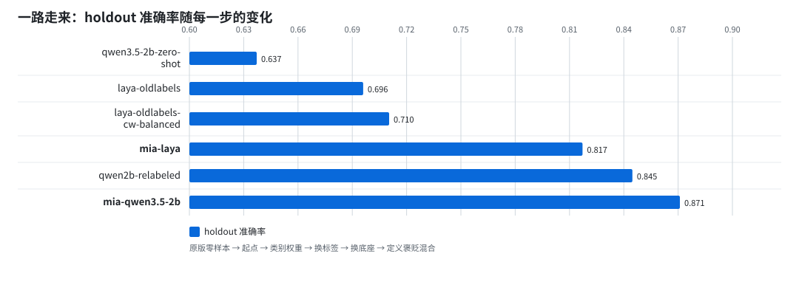
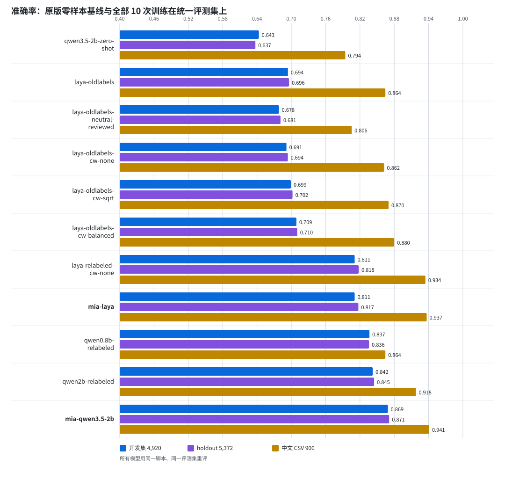
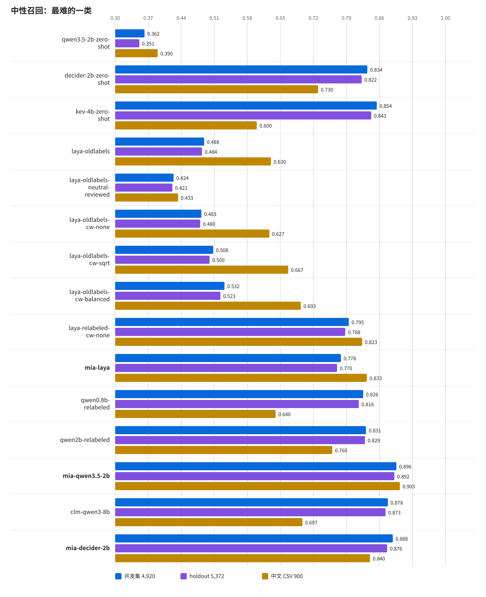
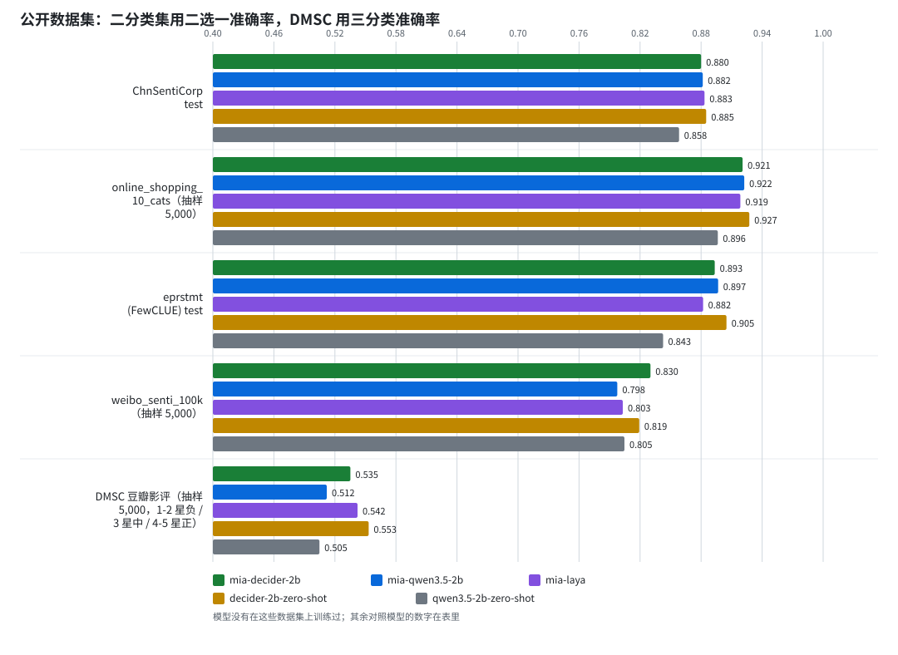
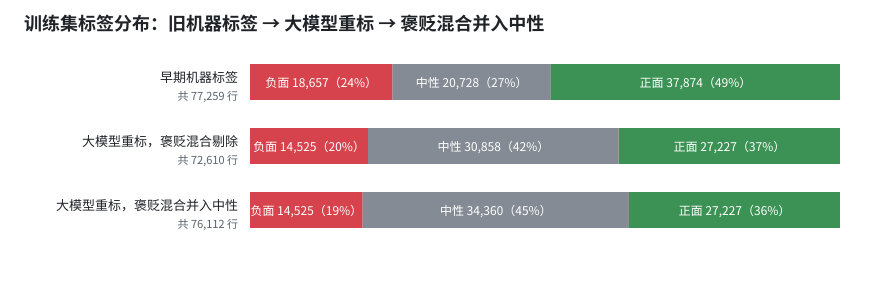
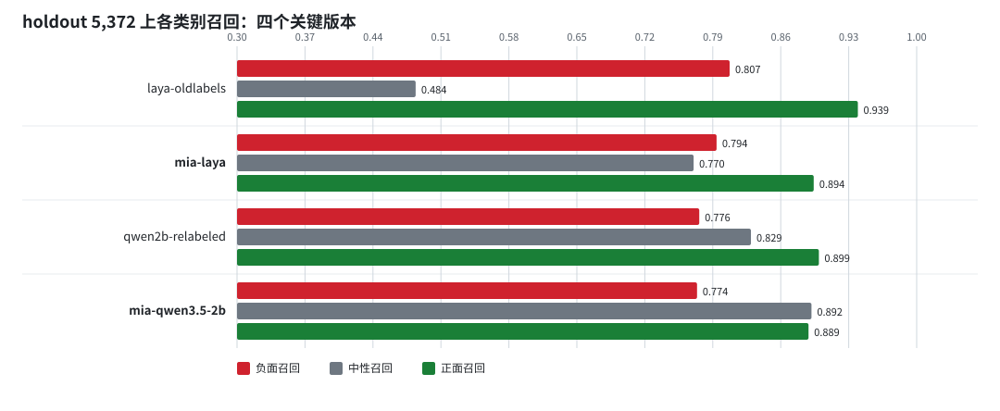
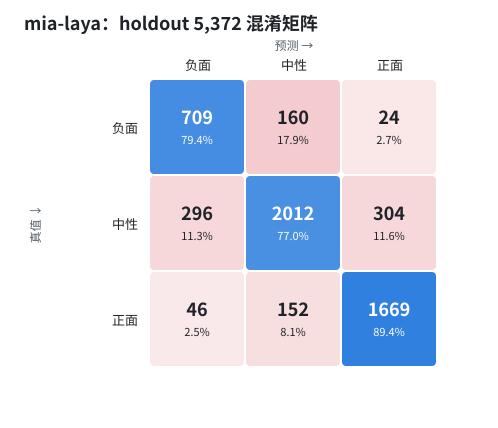
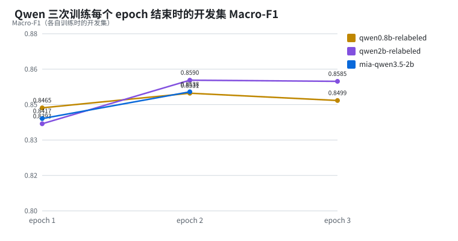

# Mia · 中文短文本情感三分类

Mia 是一组给中文短文本判「负面 / 中性 / 正面」的小模型。这个仓库公开两个发布版本的权重、全部评测数据、每一次实验的报告和脚本，以及我们在标签、底座、口径上踩过的坑。

图表和完整表格见 [docs/index.html](docs/index.html)，下面是浓缩版。

## 两个版本

| 版本 | 底座 | 参数量 | holdout 5,372 Acc / Macro-F1 | 中文 900 条 Acc / Macro-F1 | 权重 | 加载方式 | 什么时候选它 |
| --- | --- | ---: | --- | --- | ---: | --- | --- |
| `mia-qwen3.5-2b` | [Qwen/Qwen3.5-2B](https://huggingface.co/Qwen/Qwen3.5-2B) 文本主干 + 线性分类头 | 1,882M | 0.8710 / 0.8564 | 0.9411 / 0.9411 | bf16 约 3.6G，对象存储下载 | `transformers` 的 `Qwen3_5TextForSequenceClassification` | 准确率优先。与 Laya 版的差距几乎全在中性文本：客观陈述、转述、褒贬并存的文本它能认出来（holdout 中性召回高 12 个百分点），负面 / 正面的精确率因此高 8 到 14 个百分点；有明确褒贬的文本两者相当。4090 上每秒约 340 条（bf16，线性注意力走 PyTorch 参考实现）。 |
| `mia-laya` | [convaiinnovations/laya-multilingual](https://huggingface.co/convaiinnovations/laya-multilingual)（mmBERT-base）判别头微调 | 322M | 0.8172 / 0.8028 | 0.9367 / 0.9362 | fp32 约 1.3G，对象存储下载 | `laya` SDK 0.3.20 的 `laya.load` | 吞吐优先。4090 上每秒约 1,600 条，一张 8G 卡就能跑。 |

两个版本都在同一套评测集上评，标签口径相同；数字都是校准温度之后的。两个对照：起点模型（早期标签 + Laya）在同一 holdout 上是 0.6960 / 0.6882，中文 900 条 0.8644 / 0.8564；未微调的原版 Qwen3.5-2B 用同一套三分类口径的提示词零样本作答（关思考，受限选择三个标签词），holdout 0.6372 / 0.6283，中文 900 条 0.7944 / 0.7738。微调把同一个底座在 holdout 上抬了 23 个百分点。



## 成绩总览

十次训练全部用同一脚本在三套评测集上重评，每格是 准确率 / Macro-F1 / 中性召回。评测集的定义在「数据」一节。

| 模型 | 底座 | 参数量 | 训练标签 | 类别权重 | epochs | 开发集 4,920 | holdout 5,372 | 中文 CSV 900 |
| --- | --- | ---: | --- | --- | ---: | --- | --- | --- |
| `qwen3.5-2b-zero-shot` | Qwen3.5-2B 原版，未微调，零样本受限选择 | 约 2B | 无 | — | — | 0.6433 / 0.6361 / 0.362 | 0.6372 / 0.6283 / 0.351 | 0.7944 / 0.7738 / 0.390 |
| `laya-oldlabels` | Laya multilingual (mmBERT-base) | 322M | 早期机器标签 | none | 3 | 0.6941 / 0.6888 / 0.488 | 0.6960 / 0.6882 / 0.484 | 0.8644 / 0.8564 / 0.630 |
| `laya-oldlabels-neutral-reviewed` | Laya multilingual (mmBERT-base) | 322M | 早期机器标签 + 两轮 AI 复核中性 | none | 3 | 0.6785 / 0.6725 / 0.424 | 0.6811 / 0.6739 / 0.421 | 0.8056 / 0.7807 / 0.433 |
| `laya-oldlabels-cw-none` | Laya multilingual (mmBERT-base) | 322M | 早期机器标签 | none | 3 | 0.6915 / 0.6862 / 0.483 | 0.6940 / 0.6863 / 0.480 | 0.8622 / 0.8540 / 0.627 |
| `laya-oldlabels-cw-sqrt` | Laya multilingual (mmBERT-base) | 322M | 早期机器标签 | sqrt | 3 | 0.6992 / 0.6931 / 0.508 | 0.7022 / 0.6935 / 0.500 | 0.8700 / 0.8642 / 0.667 |
| `laya-oldlabels-cw-balanced` | Laya multilingual (mmBERT-base) | 322M | 早期机器标签 | balanced | 3 | 0.7089 / 0.7031 / 0.532 | 0.7103 / 0.7014 / 0.523 | 0.8800 / 0.8754 / 0.693 |
| `laya-relabeled-cw-none` | Laya multilingual (mmBERT-base) | 322M | 大模型重标（褒贬混合剔除） | none | 3 | 0.8108 / 0.7951 / 0.795 | 0.8178 / 0.8015 / 0.788 | 0.9344 / 0.9339 / 0.823 |
| **`mia-laya`** | Laya multilingual (mmBERT-base) | 322M | 大模型重标（褒贬混合剔除） | balanced | 3 | 0.8108 / 0.7974 / 0.778 | 0.8172 / 0.8028 / 0.770 | 0.9367 / 0.9362 / 0.833 |
| `qwen0.8b-relabeled` | Qwen3.5-0.8B 文本主干 | 752M | 大模型重标（褒贬混合剔除） | none | 3 | 0.8366 / 0.8233 / 0.826 | 0.8358 / 0.8236 / 0.816 | 0.8644 / 0.8607 / 0.640 |
| `qwen2b-relabeled` | Qwen3.5-2B 文本主干 | 1,882M | 大模型重标（褒贬混合剔除） | none | 3 | 0.8423 / 0.8300 / 0.831 | 0.8448 / 0.8311 / 0.829 | 0.9178 / 0.9166 / 0.760 |
| **`mia-qwen3.5-2b`** | Qwen3.5-2B 文本主干 | 1,882M | 大模型重标（褒贬混合并入中性） | none | 2 | 0.8689 / 0.8543 / 0.896 | 0.8710 / 0.8564 / 0.892 | 0.9411 / 0.9411 / 0.903 |

第一行是对照，不是训练：原版 Qwen3.5-2B 拿到与 Mia 训练口径相同的三类定义（褒贬并存算中性），关闭思考模式，只比较下一个 token 在「负面 / 中性 / 正面」三个词上的 logits，没有微调也没有校准。它在 holdout 上把 2,612 条中性里的 1,268 条判成负面，负面召回 0.985、中性召回 0.351；微调后的 `mia-qwen3.5-2b` 用同一个底座把 holdout 从 0.6372 抬到 0.8710。批量左填充与逐条不填充的结果在 48 条自检上有 1 条 argmax 不同，概率最大差 0.06。




每个模型的完整报告（`metrics.json`、`history.json`、`training-config.json`、开发集 / holdout / 中文 CSV 的评估）在 `reports/<模型名>/`，汇总在 `reports/summary.json`。

## 公开数据集上的成绩

两个发布版和起点模型没有在下面任何一个数据集上训练过，全部是直接拿来测。这些集子大多只有正负两类，而 Mia 有三类，所以每个二分类集给四个数：**二选一准确率**只比较正、负两类的概率，是和二分类模型对齐的口径；**三选一严格准确率**把判成中性的行都算错；**判为中性的比例**说明模型有多少行没有给出极性；**只看给出极性的行的准确率**说明它一旦表态有多准。豆瓣影评用星级凑出三类，3 星当中性只是近似。文本先做与训练相同的归一化并截到 512 字。

| 公开数据集 | 行数 | 指标 | `mia-qwen3.5-2b` | `mia-laya` | `laya-oldlabels` | `qwen3.5-2b-zero-shot` |
| --- | ---: | --- | ---: | ---: | ---: | ---: |
| [ChnSentiCorp](https://huggingface.co/datasets/lansinuote/ChnSentiCorp) test，酒店 / 书籍 / 电脑评论 | 1,200 | 二选一准确率 | 0.8817 | 0.8833 | 0.8783 | 0.8583 |
| | | 三选一严格准确率 | 0.6508 | 0.8225 | 0.8275 | 0.8067 |
| | | 判为中性的比例 | 0.312 | 0.087 | 0.083 | 0.082 |
| | | 只看给出极性的行的准确率 | 0.9455 | 0.9005 | 0.9027 | 0.8784 |
| [online_shopping_10_cats](https://huggingface.co/datasets/dirtycomputer/online_shopping_10_cats)，十类商品评论，抽样 | 5,000 | 二选一准确率 | 0.9224 | 0.9186 | 0.9192 | 0.8964 |
| | | 三选一严格准确率 | 0.7754 | 0.8786 | 0.8754 | 0.8562 |
| | | 判为中性的比例 | 0.199 | 0.058 | 0.066 | 0.062 |
| | | 只看给出极性的行的准确率 | 0.9676 | 0.9325 | 0.9377 | 0.9130 |
| [eprstmt](https://huggingface.co/datasets/suolyer/eprstmt)（FewCLUE）test，电商评论 | 610 | 二选一准确率 | 0.8967 | 0.8820 | 0.8803 | 0.8426 |
| | | 三选一严格准确率 | 0.6721 | 0.8180 | 0.8033 | 0.7918 |
| | | 判为中性的比例 | 0.298 | 0.087 | 0.120 | 0.092 |
| | | 只看给出极性的行的准确率 | 0.9579 | 0.8959 | 0.9125 | 0.8718 |
| [weibo_senti_100k](https://huggingface.co/datasets/dirtycomputer/weibo_senti_100k)，微博，表情符号推出的标签，抽样 | 5,000 | 二选一准确率 | 0.7976 | 0.8030 | 0.8278 | 0.8046 |
| | | 三选一严格准确率 | 0.6162 | 0.6650 | 0.7680 | 0.7810 |
| | | 判为中性的比例 | 0.271 | 0.192 | 0.086 | 0.034 |
| | | 只看给出极性的行的准确率 | 0.8455 | 0.8228 | 0.8399 | 0.8085 |
| [DMSC](https://huggingface.co/datasets/BerlinWang/DMSC) 豆瓣影评，1-2 星负 / 3 星中 / 4-5 星正，抽样 | 5,000 | 三分类准确率 | 0.5120 | 0.5422 | 0.5728 | 0.5048 |
| | | 三分类 Macro-F1 | 0.4992 | 0.4666 | 0.4890 | 0.4214 |
| | | 中性（3 星）召回 | 0.508 | 0.216 | 0.235 | 0.111 |



怎么读：

- 商品和酒店评论上，两个 Mia 版本的二选一准确率在 0.88 到 0.92，`mia-qwen3.5-2b` 一旦表态准确率 0.95 到 0.97。在这些数据集自己的训练集上微调过的模型通常能报到 0.95 上下，跨领域直接测差 3 到 7 个百分点，主要差在长评论：ChnSentiCorp 平均 100 多字、常常一段夸一段骂，而训练文本不超过 100 字。
- `mia-qwen3.5-2b` 把两成到三成的评论判成中性，严格准确率因此最低。这不是它读不懂，是它按训练口径把褒贬并存和纯陈述当成了中性，而这些数据集没有中性这个选项。要用它做二分类，请比较正负两类概率，不要看 argmax。
- 微博集的标签来自表情符号，不是人工判断；三个模型的二选一准确率都只有 0.80 到 0.83，起点模型反而最高，因为它几乎不说中性，而这个集里大量文本本来就没什么情绪。
- 豆瓣影评的 3 星并不等于中性，几个模型都只有 0.5 左右。`mia-qwen3.5-2b` 的 3 星召回 0.508 是其他模型的两倍多，说明它的“中性”确实抓到了不温不火的评价，但 3 星里一半以上其实带明确褒贬。
- 原版 Qwen3.5-2B 零样本在四个评论集上的二选一准确率比微调后低 2 到 5 个百分点（ChnSentiCorp 0.8583 对 0.8817，商品评论 0.8964 对 0.9224，eprstmt 0.8426 对 0.8967），只在标签本身就噪的微博集上打平。微调带来的不只是三分类口径，同一个底座的二分类判断也更准了。

## 数据

### 文本从哪里来

自有的中文短文本语料，覆盖电商评论、社交媒体、文学片段、学术与行业文本等，共 570,684 行，来自 1,672 个来源批次。清洗规则：NFKC 归一化，去 HTML、URL、@提及、表情与装饰符号，合并重复标点，只保留归一化后 5 到 100 个 Unicode 字符的行；同一文本不同标签的整组删除。切分按来源批次哈希分组，同一批次的文本不跨切分（80% 训练池、10% 校准池、10% 测试池）。每个批次最多取 100 行进入训练，避免单个来源主导分布，最终采样出 92,724 行：训练 77,259、校准 5,000、开发 5,000、holdout 5,465。训练集不随仓库发布，评测集全部公开。

### 早期标签哪里出了问题

这些文本原本带着早期流水线输出的机器标签。我们先在这套标签上训了五个版本，开发集准确率都卡在 0.74 附近，怎么调类别权重都只动 0.5 个百分点。把预测逐条对回元数据之后才看清：

- 一半标签来自词典。约 50% 的行由词典打分工具（PySenti + CnText）给出，没有任何语义理解；另外 46% 由一个大模型逐条打标，但解析失败时整行默认填「中性」。
- 噪声按批次成块出现。开发集 106 个来源批次里，模型与标签的一致率中位数 0.778，第 10 百分位 0.511，最低 0.277。一个车评批次 47 条里 44 条被标成中性，文本却是“非常耐心专业”“值得推荐”；一个企业访谈纪要批次 28 条全部标成正面。
- 模型常比标签对。高置信度分歧抽样里，时间戳“2023-05-15 20:24”被标成正面，高考分数单被标成正面，GBK 乱码被标成中性，“打开房门就能闻到刺鼻的烟味”被标成中性。置信度 0.9 以上的预测与标签一致率 0.934，0.5 以下只有 0.432，说明模型知道哪些是烂标签。
- 同一文本在原始导出里重复出现时的自相矛盾率：词典部分 34.5%，大模型部分 17%。

结论很直接：0.74 不是模型的上限，是和这批标签的一致率上限。

### 重标

用一个大模型（关闭思考模式，JSON 输出，每批 30 条随机混排，temperature 0）把 92,724 行全部重标，早期标签一概不用。标注口径是五选一：

> 正面：表达满意、赞赏、喜爱、愉快、感谢、期待、推荐等正面态度。
> 负面：表达不满、失望、批评、愤怒、担忧、厌恶、贬损等负面态度；反讽、阴阳怪气按作者实际态度判为负面。
> 中性：客观陈述、信息说明、提问、叙述、事实报道，作者态度或情绪不明显；作者只是转述事实、没有表明自己好恶的也算中性。
> 褒贬混合：同一段里既有明确的褒又有明确的贬，整体倾向无法归为一方。
> 无法判断：乱码、纯数字或时间戳、无实际语义、看不懂的文本。

3,091 批一次全部成功，共 329 万 prompt token、39 万 completion token。新标签与早期标签的一致率只有 65% 到 71%：训练集里早期「正面」37,874 行有 9,981 行改成中性、1,124 行改成负面，早期「负面」18,657 行有 5,421 行改成中性。「无法判断」1,147 行剔除。

「褒贬混合」在两个版本里处理不同，这是本仓库最重要的一个口径选择：

| 数据集 | 褒贬混合 | 训练行数 | 负面 / 中性 / 正面 | 用于 |
| --- | --- | ---: | --- | --- |
| `relabeled` | 剔除 3,502 行 | 72,610 | 14,525 / 30,858 / 27,227 | `mia-laya`、`qwen2b-relabeled`、`qwen0.8b-relabeled` |
| `relabeled-mixed-neutral` | 并入中性 | 76,112 | 14,525 / 34,360 / 27,227 | `mia-qwen3.5-2b` |



### 评测集（公开）

- `data/eval/test.jsonl`（开发集，4,920 行）与 `data/eval/unseen-test.jsonl`（holdout，5,372 行）：与训练集来自不同批次的真实短文本，标签是大模型重标、褒贬混合并入中性。开发集在训练时用来选模型，holdout 只在最后评一次。`data/eval/calibration.jsonl`（4,926 行）用于拟合温度。三个文件都做过个人信息扫描并剔除了命中的行。
- `data/eval/中文情感测试集_01/02/03.csv`：每份 300 条、三类各 100，覆盖 30 个行业和 5 种文体（问卷回访、社区讨论、用户评价、售后对话、服务记录），是独立标注的模板化基准。它的「中性」多为褒贬并存的过程记录，这正是 `relabeled-mixed-neutral` 口径的来源。与训练文本精确重叠为 0。
- `data/eval/relabel-raw.jsonl`：3,091 批重标的原始回答（行 id 与标签，不含文本），可核对每条标签的来历。
- `data/eval/manifest.json`：各切分的行数、SHA-256、标签分布，以及重标的提示词哈希、token 用量、早期标签到新标签的转移矩阵。

所有评测数字都是各模型在这套公开评测集上用仓库内脚本重新算出来的，不是训练时的记录。

## 训练配方

| | `mia-laya` | `mia-qwen3.5-2b` |
| --- | --- | --- |
| 底座 | `convaiinnovations/laya-multilingual`，revision `e4e9ddf2`，mmBERT-base 编码器 + Laya 判别头 | `Qwen/Qwen3.5-2B`，只加载文本主干（`Qwen3_5TextForSequenceClassification`），丢掉视觉塔、lm_head 和 MTP 头 |
| 输入 | Laya 的「文本 + 问题 + 三个选项」序列，答案取选项标记位 | `文本：{text}\n情感倾向：`，取最后一个 token 的隐状态过线性头 |
| 目标 | 三分类交叉熵，类别权重 balanced（负面 1.67 / 中性 0.78 / 正面 0.89） | 三分类交叉熵，不加权 |
| 优化 | AdamW，编码器 lr 2e-5、头 lr 1e-4，weight decay 0.01，6% warmup + 余弦，梯度裁剪 1.0 | 同左（主干 lr 2e-5、头 lr 1e-4） |
| batch / epochs | 16 × 累积 16 = 256，3 epochs | 16 × 累积 16 = 256，2 epochs |
| 精度 | fp32 权重 + bf16 自动混合精度，梯度检查点 | 同左 |
| 校准 | 训练后在 calibration 切分上拟合单一温度：1.9488 | 同左：1.7063 |
| 硬件 / 时长 | RTX 3080 20G，约 25 分钟 | RTX 4090 48G，约 40 分钟（线性注意力走 PyTorch 参考实现） |
| seed | 42 | 42 |

Qwen 的线性注意力与因果卷积没有装上 `flash-linear-attention` 和 `causal_conv1d`，用的是 transformers 自带的参考实现，只影响速度。

## 各类别与混淆矩阵

四个关键版本在 holdout 上的各类别召回：



| 模型 | 集合 | 负面 P / R / F1 | 中性 P / R / F1 | 正面 P / R / F1 | 混淆矩阵（行=真值 负/中/正） |
| --- | --- | --- | --- | --- | --- |
| `laya-oldlabels` | holdout | 0.567 / 0.807 / 0.666 | 0.892 / 0.484 / 0.627 | 0.654 / 0.939 / 0.771 | [[721, 99, 73], [491, 1264, 857], [59, 54, 1754]] |
| `mia-laya` | holdout | 0.675 / 0.794 / 0.729 | 0.866 / 0.770 / 0.815 | 0.836 / 0.894 / 0.864 | [[709, 160, 24], [296, 2012, 304], [46, 152, 1669]] |
| `qwen2b-relabeled` | holdout | 0.762 / 0.776 / 0.769 | 0.865 / 0.829 / 0.847 | 0.858 / 0.899 / 0.878 | [[693, 175, 25], [192, 2166, 254], [25, 163, 1679]] |
| `mia-qwen3.5-2b` | holdout | 0.811 / 0.774 / 0.792 | 0.861 / 0.892 / 0.876 | 0.914 / 0.889 / 0.901 | [[691, 185, 17], [143, 2329, 140], [18, 190, 1659]] |
| `laya-oldlabels` | 中文 CSV | 0.822 / 0.987 / 0.897 | 0.969 / 0.630 / 0.764 | 0.849 / 0.977 / 0.909 | [[296, 3, 1], [60, 189, 51], [4, 3, 293]] |
| `mia-laya` | 中文 CSV | 0.859 / 0.997 / 0.923 | 0.984 / 0.833 / 0.903 | 0.987 / 0.980 / 0.983 | [[299, 1, 0], [46, 250, 4], [3, 3, 294]] |
| `qwen2b-relabeled` | 中文 CSV | 0.806 / 1.000 / 0.893 | 0.991 / 0.760 / 0.860 | 1.000 / 0.993 / 0.997 | [[300, 0, 0], [72, 228, 0], [0, 2, 298]] |
| `mia-qwen3.5-2b` | 中文 CSV | 0.912 / 0.997 / 0.952 | 0.919 / 0.903 / 0.911 | 1.000 / 0.923 / 0.960 | [[299, 1, 0], [29, 271, 0], [0, 23, 277]] |

<p align="center"> </p>

十个模型在三套评测集上的全部各类别数字、中文 CSV 分表、训练侧的温度与校准误差，见 [docs/index.html](docs/index.html)。

## 训练心得

按时间顺序写，每条都有对应的数字。

**1. 先怀疑标签，再怀疑模型。** 早期标签上五个版本的开发集准确率挤在 0.739 到 0.744 之间，类别权重、复核中性、复训对照全都动不了它。把预测对回来源批次之后发现三分之一的行在一致率不到 0.7 的批次里，却贡献了 58% 的错误。换标签之后同一个底座从 0.6960 跳到 0.8172（holdout），一步抵过所有配方调整。如果你的模型在一个数据集上怎么调都是同一个数，先去抽 50 条高置信度的分歧看看标签。

**2. 机器标签的噪声不是均匀的，是按批次成块的。** 一个批次失败一次，几十行全变中性；一个词典跑一份文学作品，整份都是同一种错。这种噪声在整体统计里看不出来，按来源分组一看就露馅。它也意味着按行随机抽查标签质量会低估问题。

**3. 校准后的置信度是免费的标签质检器。** 温度校准之后 ECE 只有 0.02，置信度 0.9 以上的预测 93% 和标签一致，0.5 以下只有 43%。我们没有做任何额外训练就把「高置信度分歧」当作候选错标列表，命中率极高。

**4. 让重标器少做选择，把不确定单独放一格。** 五选一里的「褒贬混合」和「无法判断」不是为了用，是为了让另外三类干净。剔除这两类之后训练集少了 6%，但 Laya 的 holdout 准确率涨了 12 个百分点。给标注模型一个诚实的出口，比逼它三选一好。

**5. 口径没定清楚，评测集会和训练集打架。** 中文 900 条基准把褒贬并存的过程记录算中性，而我们第一版重标把这类文本剔除了。结果 Qwen 首版在真实分布上比 Laya 高 3 个百分点，在这 900 条上却低 2 个百分点，错误全在「真值中性、预测负面」一格（72 条）。把 3,502 条褒贬混合并入中性重训，那一格降到 29 条，900 条准确率从 0.9178 升到 0.9411，真实分布上还多涨了 2.6 个百分点。同一个模型能力，口径对不上就是错。公开数据集那一节里 `mia-qwen3.5-2b` 三成的“中性”也是同一件事的另一面。

**6. 底座要为任务选，不要为框架选。** Laya 的价值是「一段文本加多道题一次前向」的判别头，我们只用它做固定三分类，等于背着它的开销用一个不以中文为重点的多语言编码器。换成 Qwen3.5-2B 文本主干直接做序列分类，同一份数据 holdout 从 0.8172 到 0.8448。差距几乎全在中性一行：同一份数据下中性召回高 5.9 个百分点（0.829 对 0.770），负面、正面召回持平；换底座换来的是把客观陈述和转述认成中性的能力，而不是极性判断本身。先抑后扬的褒扬它反而更容易判成中性（中文 900 条上 23 对 3）。

**7. 小模型在分布内和分布外的表现可以差得很远。** Qwen3.5-0.8B 在开发集上只比 2B 低 0.6 个百分点（0.8366 对 0.8423），在中文 900 条上却低 5 个百分点（0.8644 对 0.9178），中性召回 0.640 对 0.760。选模型时至少留一套和训练分布不同的评测集，不然看不见这个差距。

**8. 两个 epoch 就够，第三个在背书。** 三次 Qwen 训练的开发集 Macro-F1 都在第 2 个 epoch 到顶（0.8590 / 0.8531），第 3 个 epoch 训练损失降到 0.02 而开发集持平或略降；温度也从三轮版的 2.62 到 2.95 回到两轮版的 1.71。数据只有 7 万行的时候，epoch 数是最便宜的正则化。



**9. 类别权重只能在错误之间挪位置。** 早期标签上 balanced 权重把中性召回从 0.626 提到 0.661，代价是正面召回从 0.816 掉到 0.780，Macro-F1 一动不动。它有用的场景是你明确想换一种错法，比如宁可多判中性；它救不了标签。

**10. 复训噪声要先量出来。** 同一配置在另一张卡上重训一次，各项指标差异不超过 0.004。有了这个数，0.02 的提升才敢说是真的。三块钱电费换一个置信区间，很值。

**11. 温度校准一定要做，而且要存进模型配置。** 微调后的分类器普遍过度自信：Laya 版校准前 ECE 0.09，Qwen 首版 0.094。一次一维搜索把它们压到 0.02 以下。推理时不除温度，置信度就没法用来做「拿不准的交给人」。

**12. 工程上的坑，记下来省别人一下午。** 有的大模型接口默认开着思考模式，20 个 token 的 `max_tokens` 只够它想不够它答，要在请求里显式关掉；Qwen3.5 多模态检查点的权重里有 `model.visual.*`、`lm_head.*` 和 `mtp.*`，加载文本分类头时要显式跳过；Gated DeltaNet 的参考实现能跑但慢一倍，装不上 Triton 内核也别卡在那里；venv 换过目录之后 `pip` 的 shebang 会指向旧路径，用 `python -m pip`。

## 局限

- 开发集和 holdout 的标签来自一个大模型的重标，0.87 是与它的一致率，不是与人工标注的一致率。同一个模型既标训练集又标评测集，它自身的系统性偏好测不出来。中文 900 条和五个公开数据集是独立的印证，但前者是模板生成的，后者没有中性类。我们还没有人工核对集，这是下一步最该补的东西。
- 「褒贬混合」在 `mia-qwen3.5-2b` 里被当作中性来学，这是业务口径的选择。如果你的场景需要把“既夸又骂”单独挑出来，它做不到；在没有中性类的数据上用它，请比较正负两类的概率。
- 训练文本只有 5 到 100 个字符，清洗时去掉了表情符号；长文、多段评论、表情包为主的文本不在训练分布里，公开数据集上的长评论已经能看到影响。
- 两个版本的负面召回都在 0.77 到 0.79，是三类里最低的；剩余错误集中在负面与中性之间，多是不带评价词的负面事实陈述。
- 词典标签对应的文本仍在训练池里（只是它们的早期标签没有被使用），来源家族字段在导出时丢失，无法单独剔除。

## 使用

权重不在仓库里，放在对象存储上。下载后解压到对应目录，再用仓库里的校验清单核对：

```bash
curl -LO https://files.qiansmile.com/mia/v1/mia-qwen3.5-2b-final.tar   # 约 3.8G，sha256 4889f4b532587a0791f469c2c194a7d08bf588e8c2c355fd69910f7e6a78a6ba
curl -LO https://files.qiansmile.com/mia/v1/mia-laya-final.tar          # 约 1.3G，sha256 6e8de6a9df573274a2f4fbb4ff2a6c26f4d0720fee0a3ef902e2b541b1da5be7
curl -LO https://files.qiansmile.com/mia/v1/SHA256SUMS && sha256sum -c SHA256SUMS
tar xf mia-qwen3.5-2b-final.tar -C models/mia-qwen3.5-2b/   # 得到 models/mia-qwen3.5-2b/final/
tar xf mia-laya-final.tar -C models/mia-laya/               # 得到 models/mia-laya/final/
(cd models/mia-qwen3.5-2b && sha256sum -c final.sha256)
(cd models/mia-laya && sha256sum -c final.sha256)
```

| 包 | 内容 | 大小 |
| --- | --- | ---: |
| `mia-qwen3.5-2b-final.tar` | `final/`：bf16 `model.safetensors`、`config.json`、tokenizer、`sentiment-config.json` | 3.78 GB |
| `mia-laya-final.tar` | `final/`：fp32 `model.safetensors`、`rl_agent_config.json`、`encoder/config.json`、`tokenizer/` | 1.32 GB |

### mia-qwen3.5-2b

```python
import json, torch
from transformers import AutoTokenizer
from transformers.models.qwen3_5 import Qwen3_5TextForSequenceClassification

final = 'models/mia-qwen3.5-2b/final'
cfg = json.load(open(f'{final}/sentiment-config.json', encoding='utf-8'))
tok = AutoTokenizer.from_pretrained(final)          # 右侧 padding，线性注意力层要求如此
model = Qwen3_5TextForSequenceClassification.from_pretrained(final, dtype=torch.bfloat16).cuda().eval()

texts = ['这家店的服务真的没话说', '本次记录涉及这家快递网点，相关信息来自页面与服务记录']
enc = tok([cfg['template'].format(text=t) for t in texts], return_tensors='pt', padding=True, add_special_tokens=False).to('cuda')
with torch.inference_mode():
    probs = (model(**enc).logits.float() / cfg['temperature']).softmax(-1)
for t, p in zip(texts, probs):
    print(t, dict(zip(cfg['labels'], [round(x, 3) for x in p.tolist()])))
```

输入文本请先用 `scripts/prepare-laya-sentiment.py` 里的 `normalize_text` 做与训练相同的归一化。环境：`torch>=2.14`，`transformers>=5.17`（含 `qwen3_5` 架构）。

### mia-laya

```python
import json
from laya import load

agent = load('models/mia-laya/final', device='cuda')
questions = json.load(open('models/mia-laya/questions.json', encoding='utf-8'))
print(agent.predict_batch([{'text': '这家店的服务真的没话说'}], questions, batch_size=1)[0]['answers']['sentiment'])
```

环境：`laya==0.3.20`（`scripts/requirements-laya-training.txt`）。`act_probability` 字段没有被训练，不要用它。

### 复现评测

```bash
# Laya 版：holdout 与中文 900 条
python scripts/test-laya-sentiment.py --device cuda:0 --batch-size 64
python scripts/evaluate-laya-chinese-csv.py --device cuda:0 --batch-size 64

# Qwen 版
python scripts/evaluate-qwen-sentiment.py --model models/mia-qwen3.5-2b/final --data data/eval/unseen-test.jsonl
python scripts/evaluate-qwen-sentiment.py --model models/mia-qwen3.5-2b/final --csv

# 五个公开数据集（从 Hugging Face Hub 下载到 data/public-cache/，约 170M）
python scripts/evaluate-public-benchmarks.py --model-type qwen --model models/mia-qwen3.5-2b/final
python scripts/evaluate-public-benchmarks.py --model-type laya --model models/mia-laya/final

# 原版 Qwen3.5-2B 零样本对照（--model-dir 指向从 Hugging Face 下载的 Qwen/Qwen3.5-2B）
python scripts/evaluate-qwen-zero-shot.py --model-dir /path/to/Qwen3.5-2B --self-check
python scripts/evaluate-qwen-zero-shot.py --model-dir /path/to/Qwen3.5-2B --data data/eval/unseen-test.jsonl
python scripts/evaluate-qwen-zero-shot.py --model-dir /path/to/Qwen3.5-2B --csv
python scripts/evaluate-public-benchmarks.py --model-type zero-shot --model /path/to/Qwen3.5-2B
```

训练脚本（`train-laya-sentiment.py`、`train-qwen-sentiment.py`）、重标脚本（`relabel-laya-dataset.py`，任何 OpenAI 兼容的对话接口都能用）和数据构建脚本（`prepare-laya-sentiment.py`）都在 `scripts/`，训练日志在 `logs/`。没有训练集它们跑不起来，放出来是为了把每一步怎么做的说清楚。

## 目录

```
models/mia-qwen3.5-2b/           模型卡、mia.json、final.sha256；final/（bf16 权重、tokenizer、sentiment-config.json）从对象存储下载
models/mia-laya/                 模型卡、mia.json、final.sha256、questions.json（推理时的问题定义）；final/（fp32 权重、encoder 配置、tokenizer）从对象存储下载
data/eval/                       开发集、holdout、校准集、三份中文 CSV、重标原始回答、manifest
reports/<模型名>/                 十次训练各自的 metrics / history / training-config / 开发集 / holdout / 中文 CSV 报告
reports/public/                  三个模型在五个公开数据集上的报告
reports/summary.json             全部成绩的汇总，docs 由它生成
docs/index.html, docs/charts/    图表页与 SVG（docs/build_docs.py 生成）
scripts/                         数据构建、重标、训练、评估脚本
logs/                            每次训练与重标的运行日志
```

## 许可

- `mia-qwen3.5-2b` 基于 Qwen3.5-2B，其权重许可为 Apache-2.0；`mia-laya` 基于 convaiinnovations/laya-multilingual（Apache-2.0），编码器为 jhu-clsp/mmBERT-base。
- 本仓库的代码、报告与评测数据的许可：**待项目所有者确定**。

## 致谢

Laya（convaiinnovations）、Qwen 团队、jhu-clsp 的 mmBERT，以及 ChnSentiCorp、online_shopping_10_cats、eprstmt、weibo_senti_100k、DMSC 这几个公开数据集的整理者。
